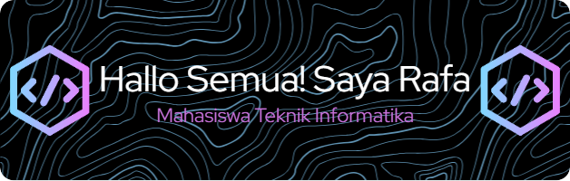

##  Hello World! I'm Rafa Prayata 👋

  

🎓 Informatics Engineering student who loves building real-world tech projects.  
💻 Currently focused on web development — especially backend and CSS styling with Tailwind.

---

### 👨‍💻 About Me

- 🔧 I enjoy working on logic and layout more than highly interactive frontend  
- 💡 Passionate about exploring Laravel, TailwindCSS, and JavaScript  
- 🔄 I build projects for practice  
- 🔍 Familiar with Git and use Laragon for local development  

---

### 🚀 Currently Learning

- Laravel & PHP in more depth  
- JavaScript (including MERN Stack)  
- Python for GUI apps using Kivy  

---

### 🛠️ Skills

  
  
  
  
  
  
  
  
  
  
  

---

### 🌐 Contact & Collaboration

- 📫 Email: [rafaprayatarakiputra@gmail.com](mailto:rafaprayatarakiputra@gmail.com)  

- 💬 Open to collaboration or just chatting about code & digital dakwah!

---

<picture>
  <source media="(prefers-color-scheme: dark)" srcset="https://raw.githubusercontent.com/maurodesouza/maurodesouza/output/pacman-contribution-graph-dark.svg">
  <source media="(prefers-color-scheme: light)" srcset="https://raw.githubusercontent.com/maurodesouza/maurodesouza/output/pacman-contribution-graph.svg">
  
</picture>

###

> _"Keep learning, even if you're not perfect yet."_ — Rafa, an Informatics student who codes while juggling assignments
